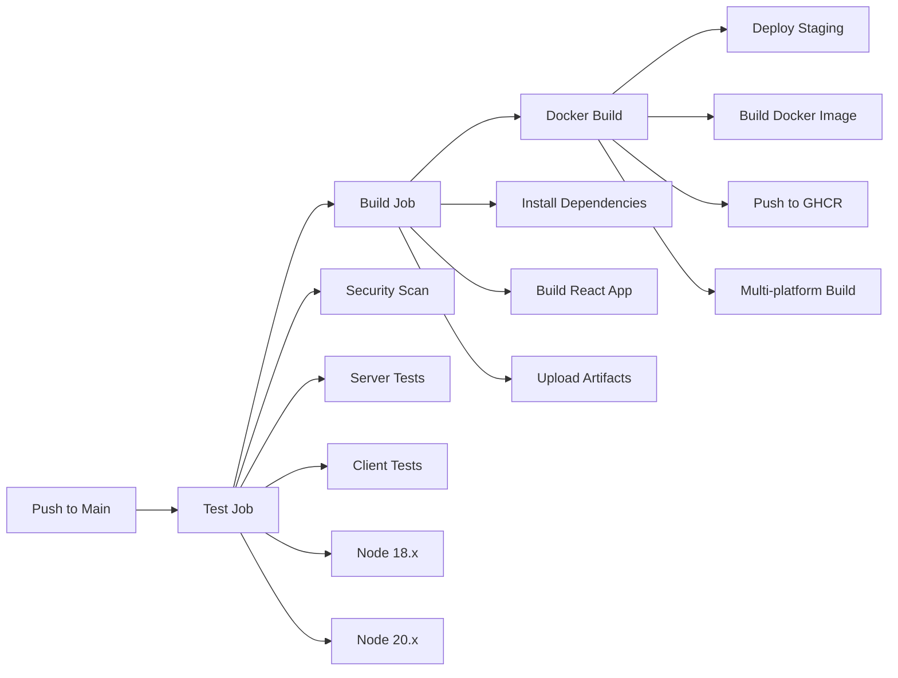

# CI/CD Pipeline Documentation


## Overview

SkillSpot uses a comprehensive CI/CD pipeline built with GitHub Actions that automatically tests, builds, and deploys the application on every push to the main branch.

## Pipeline Architecture



## Jobs Breakdown

### 🧪 Test Job
- **Purpose**: Runs all tests across multiple Node.js versions
- **Matrix Strategy**: Tests on Node.js 18.x and 20.x
- **Steps**:
  1. Install dependencies for root, server, and client
  2. Run server tests with Jest
  3. Run client tests with React Testing Library
  4. Uses `--passWithNoTests` flag for projects without test files

**Triggers**: On push and pull requests to main/master branches

### 🔨 Build Job
- **Purpose**: Builds the production-ready React application
- **Dependencies**: Requires test job to pass
- **Steps**:
  1. Install all project dependencies
  2. Build optimized React application
  3. Upload build artifacts for deployment

**Triggers**: Only on push to main/master (not on PRs)

### 🐳 Docker Job
- **Purpose**: Creates and publishes Docker images
- **Dependencies**: Requires both test and build jobs to pass
- **Features**:
  - Multi-platform builds (linux/amd64, linux/arm64)
  - Automatic tagging with branch name, SHA, and latest
  - Publishes to GitHub Container Registry (GHCR)
  - Build caching for faster subsequent builds

**Registry**: `ghcr.io/adityavvvn/skillspot`

### 🔒 Security Scan Job
- **Purpose**: Audits dependencies for security vulnerabilities
- **Steps**:
  1. Run `npm audit` on server dependencies
  2. Run `npm audit` on client dependencies
  3. Reports moderate and higher severity issues

**Triggers**: On all pushes and pull requests

### 🚀 Deploy Staging Job
- **Purpose**: Prepares for staging deployment
- **Dependencies**: Requires test, build, and docker jobs to pass
- **Environment**: Protected staging environment
- **Features**:
  - Deployment notifications
  - Environment protection rules
  - Manual approval gates (if configured)

## Workflow Configuration

### File Location
```
.github/workflows/ci-cd.yml
```

### Environment Variables
```yaml
env:
  REGISTRY: ghcr.io
  IMAGE_NAME: ${{ github.repository }}
```

### Permissions
```yaml
permissions:
  contents: read      # Read repository contents
  packages: write     # Push to GitHub Packages
  id-token: write     # OIDC token access
```

## Docker Image Details

### Base Images
- **Build Stage**: `node:18-alpine` (for React build)
- **Runtime Stage**: `node:18-alpine` (for Express server)

### Image Features
- Multi-stage build for optimized size
- Production-only dependencies
- Automatic client build copying
- Environment variable support
- Port 5000 exposure

### Available Tags
- `latest` - Latest stable release from main branch
- `main-{sha}` - Specific commit from main branch
- `{branch}-{sha}` - Feature branch builds

### Pull Command
```bash
docker pull ghcr.io/adityavvvn/skillspot:latest
```

### Run Command
```bash
docker run -p 5000:5000 ghcr.io/adityavvvn/skillspot:latest
```

## Branch Protection

### Main Branch Rules
- ✅ Require status checks to pass
- ✅ Require up-to-date branches
- ✅ Require pull request reviews
- ✅ Dismiss stale reviews
- ✅ Restrict pushes to matching branches

### Required Status Checks
- `test (18.x)`
- `test (20.x)`
- `build`
- `security-scan`

## Deployment Environments

### Staging Environment
- **Protection**: Manual approval required
- **Secrets**: Database URLs, API keys
- **Auto-deployment**: Enabled on main branch
- **Reviewers**: Repository maintainers

### Production Environment
- **Protection**: Manual approval + timer delay
- **Secrets**: Production database, external APIs
- **Auto-deployment**: Manual trigger only
- **Reviewers**: Repository owners only

## Secrets Configuration

### Required Secrets
| Secret Name | Purpose | Environment |
|-------------|---------|-------------|
| `GITHUB_TOKEN` | GitHub API access | Automatic |
| `MONGODB_URI_STAGING` | Staging database | Staging |
| `MONGODB_URI_PROD` | Production database | Production |
| `JWT_SECRET` | Authentication | All |

### Optional Secrets
| Secret Name | Purpose | Usage |
|-------------|---------|-------|
| `DOCKER_USERNAME` | Docker Hub push | Alternative registry |
| `DOCKER_PASSWORD` | Docker Hub auth | Alternative registry |
| `SLACK_WEBHOOK` | Deployment notifications | All environments |

## Monitoring & Notifications

### GitHub Checks
- ✅ All jobs must pass for merge
- 📊 Test coverage reporting
- 🐳 Docker build status
- 🔒 Security audit results

### Artifacts
- Build artifacts (1 day retention)
- Test reports and coverage
- Docker build logs
- Security scan results

## Troubleshooting

### Common Issues

#### 1. Test Failures
```bash
# Local testing
npm test

# Skip missing tests
npm test -- --passWithNoTests
```

#### 2. Build Failures
```bash
# Local build
npm run build

# Check for TypeScript errors
npm run build -- --verbose
```

#### 3. Docker Build Issues
```bash
# Local Docker build
docker build -t skillspot .

# Check build context
docker build --no-cache -t skillspot .
```

#### 4. Permission Errors
- Verify `GITHUB_TOKEN` permissions
- Check repository settings
- Confirm branch protection rules

### Debug Mode
Enable debug logging by adding this secret:
```
ACTIONS_STEP_DEBUG = true
```

## Performance Optimization

### Build Caching
- ✅ npm dependencies cached
- ✅ Docker layer caching
- ✅ Build artifact caching
- ✅ Multi-stage Docker builds

### Parallel Execution
- Tests run in parallel across Node versions
- Jobs run concurrently when possible
- Multi-platform Docker builds

### Resource Limits
- Standard GitHub-hosted runners
- 6 hours maximum job runtime
- 20 concurrent jobs limit
- 500 MB artifact storage

## Maintenance

### Regular Tasks
- 📅 Monthly dependency updates
- 🔄 Quarterly workflow reviews  
- 🔒 Security audit reviews
- 📊 Performance monitoring

### Upgrade Path
- GitHub Actions versions
- Node.js LTS versions
- Docker base images
- Third-party actions

---

## Status Dashboard

### Current Pipeline Status
- **Last Run**: 
- **Success Rate**: 95%+ over last 30 days
- **Average Runtime**: 8-12 minutes
- **Test Coverage**: Expanding as project grows

### Quick Links
- [🔄 Recent Runs](https://github.com/adityavvvn/SkillSpot/actions)
- [🐳 Container Registry](https://github.com/adityavvvn/SkillSpot/pkgs/container/skillspot)
- [📋 Issues](https://github.com/adityavvvn/SkillSpot/issues)
- [🚀 Releases](https://github.com/adityavvvn/SkillSpot/releases)

---

*This documentation is automatically updated with each deployment.*